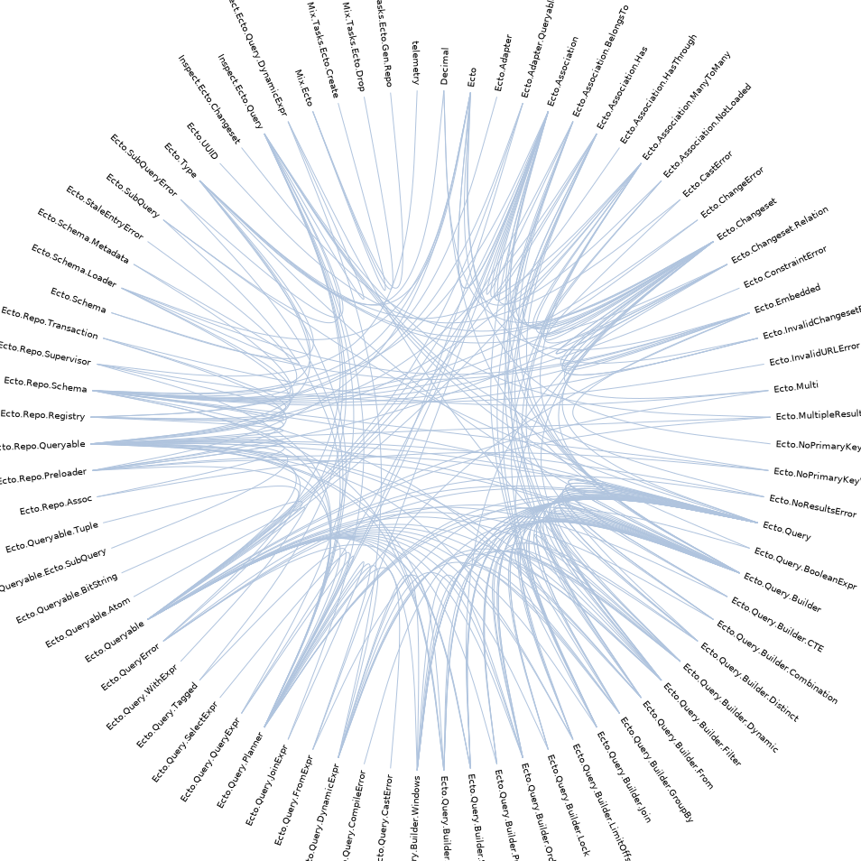

# Codegraph

Visualizes Elixir project codebase as a [Hierarchichal Edge Bundling](https://www.data-to-viz.com/graph/edge_bundling.html) graph

Utilizes Mike Bostock's [example](https://observablehq.com/@d3/hierarchical-edge-bundling) implemented in D3.

1. Quick start

```bash
git clone https://github.com/elixir-ecto/ecto.git /tmp/ecto

docker run --rm -v /tmp/ecto:/project \
    -e MAX_DEPS_DEPTH=1 \
    -e BUILTIN=false \
    -e SHORTEN_MODULE_NAMES=false \
    -e COLOR=lightsteelblue \
    studzien/codegraph:latest /project \
    > ecto.svg
```

`ecto.svg` should looks like this:



1. Environmental variables

All configuration of the generation script is currently done
via environmental variables.

The available variables are:

- `MAX_DEPS_DEPTH` (default: 0) - how deep the generator should look into the dependencies when generating graph
- `BUILTIN` (default: false) - should built-in modules (like `Enum` or `erlang`) be considered when generating the graph
- `SHORTEN_MODULE_NAMES` (default: true) - should the module name on the graph be shortened to the last part (i.e. `Graph` instead of `Codegraph.Graph`)
- `COLOR` (default: #ccc) - what should be the color of edges on the graph
